<h1>📲 Hiwar Marifa </h1> 

Hiwar Marifa app is a world for Software engineers to chat with each other


| Splash                                   | Register                                    | Login                                         |
| -----------------------------------------| ------------------------------------------- | --------------------------------------------- |
| 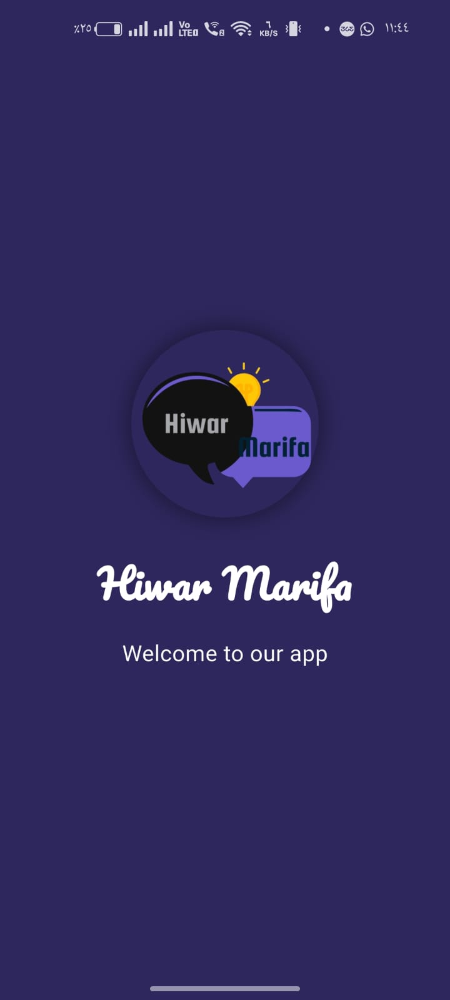| 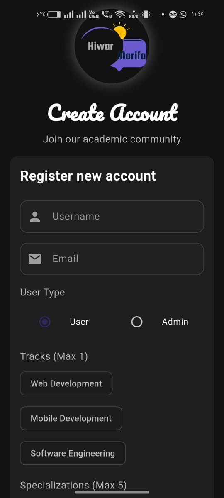 | 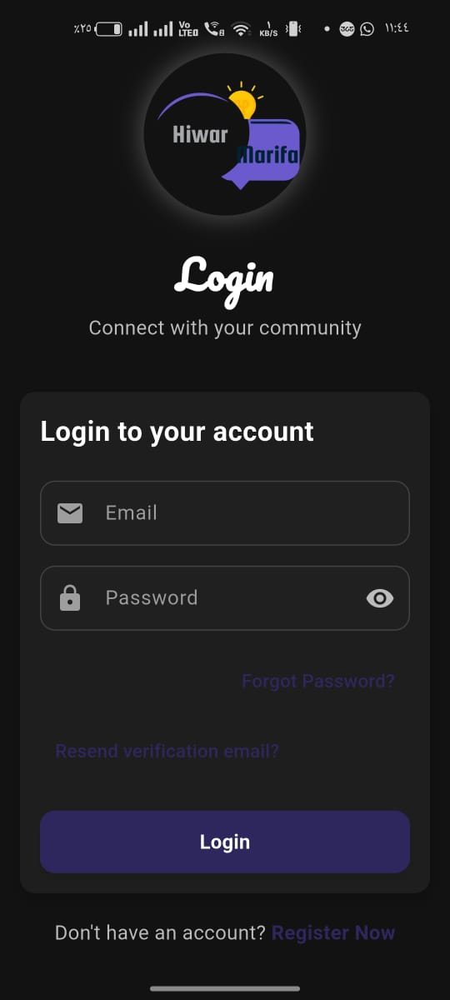 |


---

## ✨ Features

- 🔐 Secure login & register system
- 💬 Realtime group messaging
- 🕵️ Anonymous messages (only visible to admin/moderator)
- 👥 Group with roles: Admins, Members
- 🚫 Pull system inside the group
- 🌗 Light & Dark theme support
- 📱 Responsive and modern UI

---

## 🛠 Tech Stack

| Technology          | Description         |
| ------------------- | ------------------- |
| **Flutter**         | UI Development      |
| **Firebase Auth**   | User Authentication |
| **Cloud Firestore** | Real-time Database  |
| **Provider**        | State Management    |

---

## 📸 Screenshots

| chat 1                            | chat 2                                | Notification                         | Home Page                            |group Setting                            |
| --------------------------------- | ------------------------------------- | ------------------------------------ | ------------------------------------ |
| 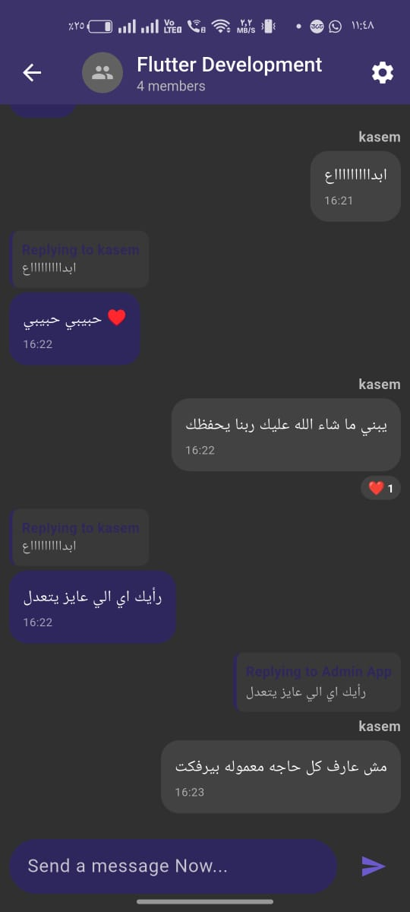 |  | 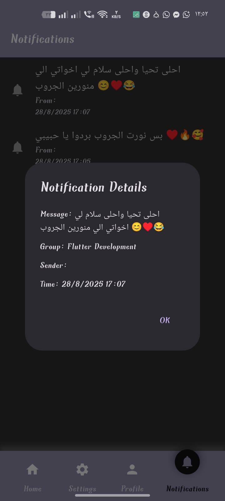 |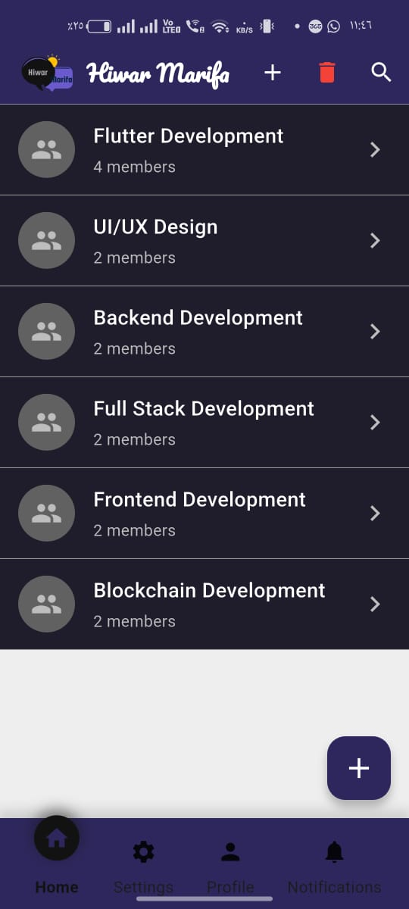 |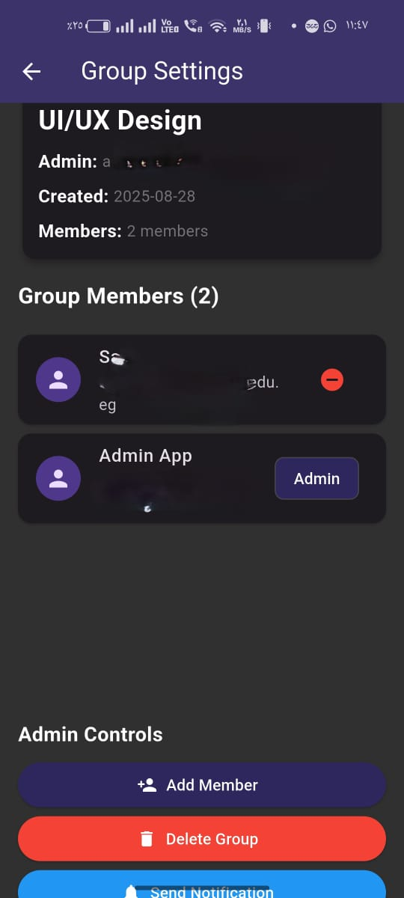 |

| Mode (Light)                                | Mode (Dark)                               | Mode (Light)                             | Mode (Dark)                            |
| ------------------------------------------- | ----------------------------------------- | ---------------------------------------- | -------------------------------------- |
| 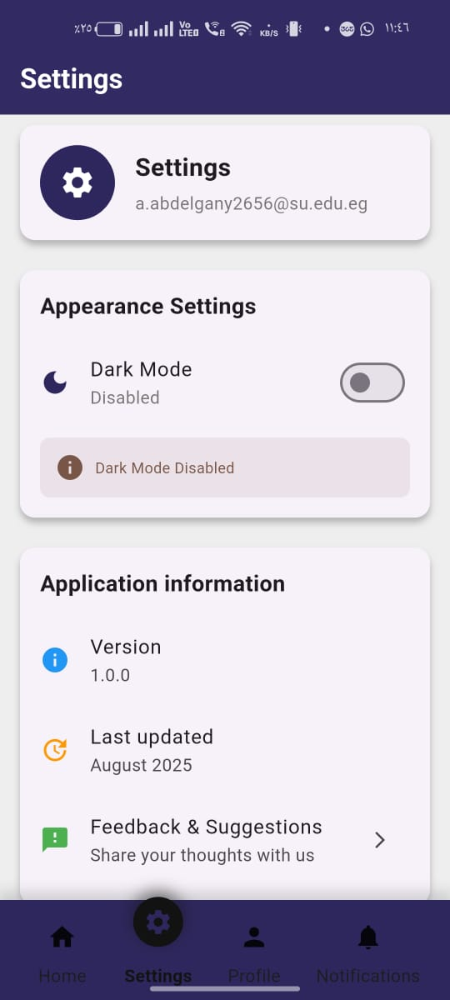 | 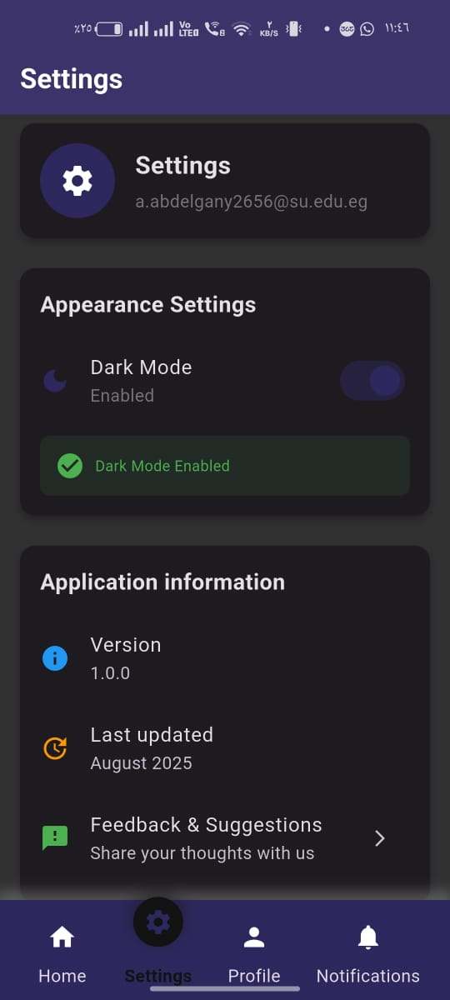 | 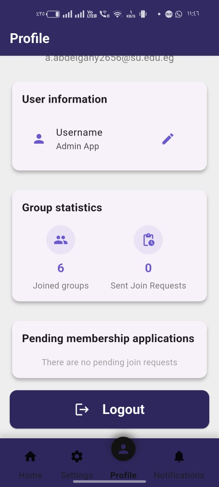 | 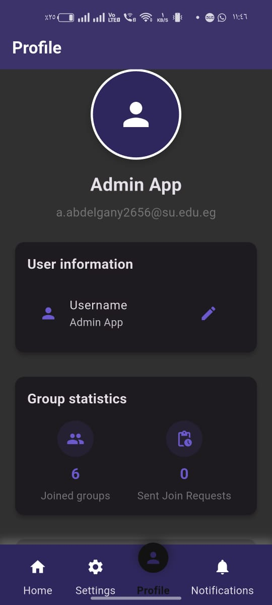 |

---

## 🌱 Project Structure

```bash
> The full folder structure for the lib:      
> lib       
├── main.dart                      # Entry point of the app (runApp, theme, routes, providers)     
├── core                           # Core utilities and shared configurations    
│   ├── constants    
│   │   └── constants.dart         # Global constants (strings, collection names, routes, etc.)   
│   ├── helper    
│   │   └── show_snackbar.dart     # Helper function to show Snackbars in a unified way   
│   ├── services   
│   │   └── firebase_options.dart  # Firebase initialization and configuration (auto-generated)   
│   └── themes   
│       └── app_theme.dart         # Application theme (colors, typography, styles)  
├── data                           # Data layer (models and data-related logic)   
│   ├── build                      # Empty for now (could be used for build-related data/files)   
│   └── models   
│       ├── groups_model.dart      # Data model representing a chat group   
│       ├── messages_model.dart    # Data model representing a chat message   
│       └── user_model.dart        # Data model representing a user   
├── presentation                   # UI layer (pages + reusable widgets)   
│   ├── pages    
│   │   ├── auth    
│   │   │   ├── email_verification_page.dart # Page for verifying user email   
│   │   │   ├── login_page.dart              # Login page   
│   │   │   └── register_page.dart           # Registration page   
│   │   ├── chat   
│   │   │   ├── chat_page.dart               # Chat conversation page   
│   │   │   └── group_management_page.dart   # Manage groups (create, edit, etc.)    
│   │   ├── home   
│   │   │   ├── home_page.dart               # Main home page after login     
│   │   │   ├── notifications_page.dart      # Page for displaying notifications   
│   │   │   ├── profile_page.dart            # User profile page   
│   │   │   └── settings_page.dart           # Settings page    
│   │   ├── splash_page.dart                 # Splash screen (initial app load)    
│   │   └── start_page.dart                  # Start/Welcome page before authentication    
│   └── widgets   
│       ├── auth    
│       │   ├── custom_button.dart           # Reusable custom button for auth screens    
│       │   └── custom_text_feild.dart       # Reusable custom TextField for auth    
│       ├── chat    
│       │   ├── build_chat.dart              # Widget to build chat interface      
│       │   ├── chat_widgets.dart            # Common reusable chat widgets     
│       │   └── custom_message.dart          # Widget for rendering a single chat message     
│       └── home    
│           ├── build_home.dart              # Widget to build home page UI      
│           ├── custim_group.dart            # Widget for displaying groups in home    
│           └── dialog_widgets.dart          # Reusable dialogs for home page      
└── provider     
    ├── auth_provider.dart                   # State management for authentication     
    └── chat_provider.dart                   # State management for chat/groups     

